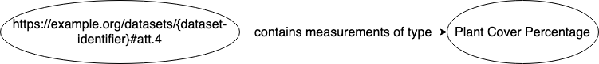

# Semantic Annotations in EML 2.2
O’Brien, Chong, Schildhauer 

Databits 2019 Spring

# Introduction

A semantic annotation is the attachment of semantic metadata to a resource. It provides precise 
definitions of concepts and clarifies the relationships between concepts in a computer-usable way. The process of 
creating semantic annotations may seem tedious, but the payoff is enhanced data retrieval and discovery. Semantic 
annotations will make it easier for others to find and reuse your data. 

For  example, if a dataset is annotated as being about "carbon dioxide flux" and another annotated with 
"CO2 flux" the information system should recognize that the datasets are about equivalent concepts. 
In another example, if you perform a search for datasets about "litter" (as in "plant litter"), the 
system will be able to disambiguate the term from the many meanings of "litter" (as in garbage, the grouping of 
animals born at the same time, etc.). Yet another example is if you search for datasets about "carbon flux", 
then datasets about "carbon dioxide flux" can also be returned because "carbon dioxide flux" is 
considered a type of "carbon flux". 

EML 2.2 will have the capacity to add semantic statements, as annotations to datasets 
(EML Development Committee, 2019). 
Here, we describe those features briefly and give examples of two common annotations - at the dataset-level
and attribute-level. The EML development committee is creating a Semantic Primer 
that will be released along with other EML 2.2 documentataion.


# Semantic Triples
Semantic annotations enable the creation of "triples", which are 3-part statements composed of
a **subject**, an **predicate** (sometimes called object property or data property), and an **object**.
```
[subject] [predicate] [object]
```
These components are analogous to parts of a sentence; the **subject** 
and **object** can be thought of as nouns in the sentence and the **predicate** 
is akin to a verb or relationship that connects the **subject** and **object**. 
The semantic triple  expresses the statement about the associated resource. 
After processing the EML into a semantic web format, 
such as RDF/XML, the semantic statement becomes interpretable by machines. 

RDF is *not* designed to be displayed to people. It is designed so that components are accessible 
through the Web, for computers to look up precise definitions and relationships between these resources 
and other concepts. To simplfy their use, the three components of a semantic triple should be 
HTTP URIs (uniform resource identifiers), which are 

- globally unique and persistent (unchanging), and
- resolvable or dereferenceable


The simplest 
triple statement is a sequence of (subject, predicate, object) terms, separated by whitespace and 
terminated by '.' (rud'hommeaux & Carothers, 2014). Below is the sematic statement for the relationship 
between Spiderman and the 
Green Goblin, with fictional URIs:

```
<http://example.org/#spiderman> <http://example.org/#enemyOf> <http://example.org/#green-goblin> .
```

Below is a true triple created for a Jornada LTER dataset. The URIs resolve, to say that a 
dataset (subject) was "located in" (predicate/property) a "desert area" (object/value). The subject 
dereferences to a dataset in PASTA, knb-lter-jrn.210327001.1, the predicate to a relationship ontology, 
and the object to a concept in the Environment Ontology, which contains a complex definition and 
cross references for “desert area”. 

```
<https://doi.org/10.6073/pasta/06db7b16fe62bcce4c43fd9ddbe43575> <http://purl.obolibrary.org/obo/RO_0001025> <http://purl.obolibrary.org/obo/ENVO_00000097> .
```

The “located in” relationship means that more precise searches can be constructed, e.g. a computer can 
return this dataset alongside other datasets that are "located in" a precisely defined area called a 
"desert" -- not just related to deserts in some unknown way, which is all that is possible with keywords. 

## Semantic Annotations in EML 2.2.0
In **EML 2.2.0** there are 5 places where annotation elements can appear in an EML document: 

- **top-level resource**  -- an `annotation` element is a child of `dataset`, `literature`, `software`, `protocol` 
- **entity-level** -- an `annotation` element is a child of a dataset's entity (e.g., `dataTable` )
- **attribute** -- an `annotation` element is a child of a dataset entity's `attribute` element
- **eml/annotations** -- a container for a group of `annotation` elements, using references
- **eml/additionalMetadata** -- `annotation` elements that reference a main-body element by its id

### Annotation element structure
All annotation nodes are defined as an XML type, so they have the same structure anywhere they appear
in the EML record. Here is the basic structure. Specific examples are below. The annotation node
holds the `predicate` and `object`; the `subject` of the semantic statement is the parent element of the 
annotation.

```xml
    <annotation>
        <propertyURI label="property label here">property URI here</propertyURI>
        <valueURI label="value label here">value URI here</valueURI>
    </annotation>
```

#### Annotations map to semantic triples
The EML annotation is used to create semantic triples. The tables shows how the triple components 
`subject`, `predicate`, and `object`
map to EML annotations using the JRN statement above. 

|Triple component|EML location |Note  |Example  |
|--|--|--|--|
| `subject` |Parent element of the annotation (element just above it in the XML "tree") |To be a subject, an element must have an `id` attribute | https://doi.org/10.6073/pasta/06db7b16fe62bcce4c43fd9ddbe43575 |
| `predicate` | `//annotation/propoertyURI`  |the "verb" in a statement | http://purl.obolibrary.org/obo/RO_0001025  |
| `object` | `//annotation/valueURI` |"object" of the "verb"  | http://purl.obolibrary.org/obo/ENVO_00000097 |

**When are IDs required?**
Annotations at the dataset, entity or attribute level presume that the parent element is the *subject*; hence, if an element has
an annotation child, an id is required. Annotations at `eml/annotations` or `eml/additionalMetadata` will have 
subjects defined with a `references` attribute or `describes` element, so as for other internal EML 
references, an `id` is required.
The EML-2.2 parser checks for an `id` attribute if an annotation is present. 

**Labels**: It is recommended that the label field of the annotation is populated by the value from the preferred label field 
(`skos:prefLabel`) or label field (`rdfs:label`) from the referenced vocabulary.


### Resource level (top-level) annotations: `dataset`

The top-level resources in EML are `dataset`, `literature`, `protocol`, and `software`, and
any of them can be annotated. This example is for a dataset. **A top-level annotation applies 
to the entire resource (dataset)**.  The `annotation` element is 
the last element of the resource group (i.e., it appears right after `coverage`). 

- The *subject* of the semantic statement is the parent element of the annotation, the dataset. It must have an `id="` attribute. 
- Each annotation consists of a `propertyURI` element and `valueURI` element, which define an *object property* and the *object* (value), respectively. 
- `propertyURI` and `valueURI` elements  
  - must have a `label` attribute that is suitable for application interfaces. 
  - should have URIs that point to terms in controlled vocabularies
- Labels should be populated from the preferred labels field (`skos:prefLabel`) or label field (`rdfs:label`) in the referenced vocabulary.

In the following dataset annotation (Example 1), 

- the *subject* of the semantic statement is the parent element `dataset id="dataset-01"` 
- the *object property* is "http://purl.org/dc/elements/1.1/subject"
- the *object* (value)  is "http://purl.obolibrary.org/obo/ENVO_01000177"

Taken together, the semantic statement can be translated to "the dataset is about the subject grassland biome"

* Example 1: Top-level resource annotation (dataset)

```xml
<dataset id="dataset-01">
    <title>Data from Cedar Creek LTER on productivity and species richness for use in a workshop titled
    "An Analysis of the Relationship between Productivity and Diversity using Experimental Results from
    the Long-Term Ecological Research Network" held at NCEAS in September 1996.</title>
    <creator id="clarence.lehman">
        <individualName>
            <salutation>Mr.</salutation>
            <givenName>Clarence</givenName>
            <surName>Lehman</surName>
        </individualName>
    </creator>
    ...    
    <coverage> 
        ...
    </coverage>    
    <annotation>
        <propertyURI label="Subject">http://purl.org/dc/elements/1.1/subject</propertyURI>
        <valueURI label="grassland biome">http://purl.obolibrary.org/obo/ENVO_01000177</valueURI>
    </annotation>
      ...    
</dataset>  
```


## Attribute-level annotations: `attribute` 

An attribute annotation applies to a data entity attribute, such as a column name in a spreadsheet or table. 
It associates precise measurement semantics such as the property or "thing" being measured, the measurement standard for 
interpreting values for the attribute. 

A attribute annotation is an `annotation` element contained by an `attribute` element. 

- The *subject* of the semantic statement is the parent element of the annotation, the `<attribute>`. The XML node must have an `id="`. 
- Each annotation consists of a `propertyURI` element and `valueURI` element, which define an *object property* and the *object* (value), respectively. 
- `propertyURI` and `valueURI` elements  
  - must have a `label` attribute that is suitable for application interfaces. 
  - should have URIs that point to terms in controlled vocabularies
- Labels should be populated from the preferred labels field (`skos:prefLabel`) or label field (`rdfs:label`) in the referenced vocabulary.

In the following dataset annotation, 

- the *subject* of the semantic statement is the parent element `attribute id="att.4"` 
- the *object property* is "http://ecoinformatics.org/oboe/oboe.1.2/oboe-core.owl#containsMeasurementsOfType"
- the *object* (value)  is "http://purl.dataone.org/odo/ECSO_00001197" which resolves to the "Plant Cover Percentage" term in the ECSO Ontology (https://github.com/DataONEorg/sem-prov-ontologies/tree/master/observation). 


Taken together, the semantic statement indicates that "the attribute with the id 'att.4' contains measurements of type plant cover percentage".

* Example 2: attribute annotation

```xml
<attribute id="att.4">
    <attributeName>pctcov</attributeName>
    <attributeLabel>percent cover</attributeLabel>
    <attributeDefinition>The percent ground cover on the field</attributeDefinition>
    <annotation>
        <propertyURI label="contains measurements of type">http://ecoinformatics.org/oboe/oboe.1.2/oboe-core.owl#containsMeasurementsOfType</propertyURI>
        <valueURI label="Plant Cover Percentage">http://purl.dataone.org/odo/ECSO_00001197</valueURI>
    </annotation>
</attribute>
```


### RDF Graphs 
Below is an example of how an annotation is converted to a graph of the RDF triple. 
The parts of a triple (subject, predicate, and object)  bbecome nodes and links in a graph.




# Conclusion
Remind them about the primer again. that it will have way more examples
also will be some RDF material for reference if you are interested.

It is important to keep in mind that **Semantic statements are not simply a set of loosely structured keywords; 
they must be logically consistent**. Inconsistent annotations could have dreadful consequences. 
so the primer will also will have examples of how things can go wrong, of course hoping not to scare anyone. 

 something about 
 **Responsibilities of a data manager/EML constructor** to 
 understand the concepts in the ontologies chosen by your community,
 understand the concepts in the datasets you manage

 vs **Responsibilities of a repository (or another search-systems)**
 to understand the implied subject and create the RDF triples when needed.
 provide mechanisms to take advantage of structures in the onts chosen by their communities, 
 provide technical guidance to their communities as they choices onts and other vocabs.


# References

Prud'hommeaux E. and G. Carothers. 2014. W3C Recommendation: RDF 1.1 Turtle. 
http://www.w3.org/TR/2014/REC-turtle-20140225

EML Development Committee. 2019 https://github.com/NCEAS/eml 

